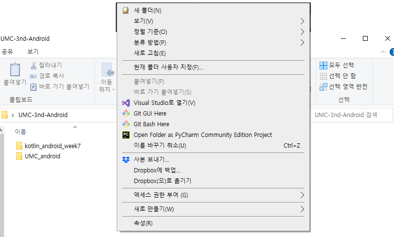

# Android 7주차

## Git 가이드
Git 사용법에 대해 7주차부터 익숙해지도록 한다.

### 1. 자신의 개인 로컬 저장소에 clone하기

- 레포지토리 첫 화면에서 레포지토리 URL을 복사한다.


- 원하는 개인 로컬 저장소에서 `Git Bash Here` 클릭
- 혹은 git bash를 먼저 키고 cd 명령어로 원하는 위치로 이동할 수 있다.


- git bash 입력창에 다음과 같이 입력한다. 첫 단계에서 복사한 URL이다.
```
$ git clone {web URL}
```

- 다음 명령어를 통해 현재 git bash가 보고 있는 경로에 존재하는 디렉토리와 파일을 볼 수 있다.
```
ls 명령어는 list의 준말이다.
$ ls
```
- 다음과 같이 형성되어 있는 것을 확인한다.


- 다음 명령어를 통해 원하는 디렉토리로 이동할 수 있다.
```
cd 명령어는 change directory의 준말이다.
$ cd "path"
```
- 예를 들어 현재 kotlin_android_week7으로 가고자 하므로 다음과 같이 입력한다.
```
$ cd kotlin_android_week7
```


### 2. 로컬 저장소에 자신의 branch 생성하기
첫 clone이 완료되었고 해당 경로로 이동했다면 `git branch` 명령어로 현재 branch와 접근 가능한 branch 목록을 확인할 수 있다.
git clone 명령어의 경우 일반적으로 해당 레포지토리의 main branch만을 clone한다.


- 다음 명령어를 통해 현재 **로컬 저장소**에 자신의 별명으로 branch를 생성한다.
다음 명령어는 bmsk라는 branch를 생성함과 동시에 해당 branch로 전환해주는 명령어이다.

```aidl
$ git checkout -b bmsk
```
**<주의>**
절대 main branch에서 작업하지 않는다.

### 3. 해당 branch에서 Android 7주차 project를 생성하고 작업한다.
다시 우리에게 익숙한 해당 폴더에 다음 미션을 위한 project를 생성하고 작업한다.
> 7주차 standard mission 요구사항에 대한 기능을 구현


### 4. 기능 구현 후 변동사항 본인 로컬(local) git에 저장하기
변동사항을 저장하기 위해서는 다시 git bash로 이동한다.
- 다음과 같이 입력한다.
```aidl
$ git status
```
- 변동사항이 있다면 다음과 비슷하게 출력된다.

- 변동사항 중 적용하고 싶은 파일이 있다면 다음과 같이 입력할 수 있다.
```aidl
$ git add {file이름}
ex) git add READEME.md
```
- 만일 모든 변동사항을 적용하고 싶다면
```aidl
$ add .
```

- add를 했다면 다음 명령어를 통해 제대로 되었는지를 확인할 수 있다.
```aidl
$ git status
```


- 지금까지 add한 변동사항들에 대해 commit을 해야 최종적으로 **로컬 저장소**에 반영된다고 할 수 있다.
```aidl
$ git commit -m {"commit에 대한 내용"}
```
이제 로컬에서의 commit을 하는 과정이 끝났다.


### 4.1 commit convention
commit message를 작성할 때 의미 없이 작성하지 않는다.  
추후에 변경 사항을 복구 하거나 어떤 변동 사항이 있었는지 확인하기 어려워질 수 있다.  
본인만의 커밋 규칙을 만들어 commit message를 작성하도록 한다.
```
ex)
git commit -m "[FEAT] #23 - MainFragment에서 리싸이클러뷰 적용 완료"
git commit -m "[FIX] #44 - ChatFragment Chat 클래스의 openChat 함수 예외사항 수정"
```


## 5. 원격(remote) 저장소에 업로드

로컬에서 했던 commit 명령어는 로컬 저장소에만 적용된다.
이를 원격으로 연결되어 있는 github.com의 저장소에 반영하기 위해서는 push 명령어를 사용한다.
```aidl
git push {원격 브랜치 이름}
$ git push origin bmsk
```
만일 위 예시에서 bmsk라는 브랜치가 원격 저장소에 없다면 bmsk 저장소가 추가된다.
origin은 원격 저장소의 (clone할 때 가져온)주소를 가리키는 포인터라고 생각하면 된다. (매번 주소를 입력하기보다 origin이라는 별칭 사용)
원격 저장소에 bmsk를 만들어서(이미 있다면 안 만들고) 현재 로컬 git에서 가장 마지막으로 한 commit을 반영시킨다.


## 6. Pull Request
7주차에서 pull request는 진행하지 않는다.
pull request는 주로 다른 branch와 merge하기 전에 요청된다.